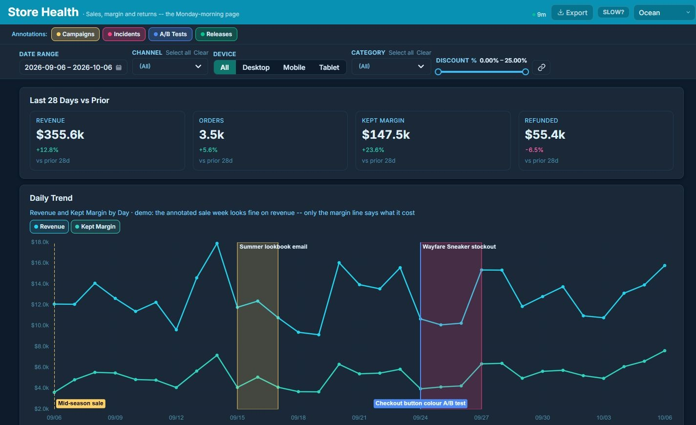
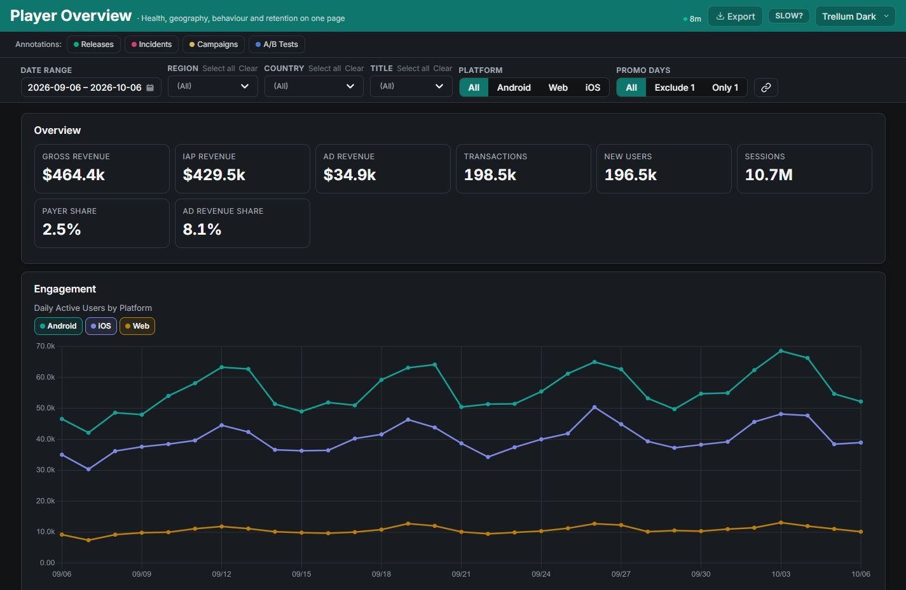

<p align="center">
  
</p>

<h1 align="center">Trellum</h1>

<p align="center">
  Build interactive reports in Python and SQL.<br>
  Work with any coding agent, review every definition in Git, and self-host when a team needs a shared home.
</p>

<p align="center">
  <a href="https://trellum.dev/">Website</a> ·
  <a href="https://trellum.dev/demo/">Live demo</a> ·
  <a href="https://trellum.dev/docs/latest/">Documentation</a> ·
  <a href="https://github.com/trellumhq/trellum">Source</a> ·
  <a href="CONTRIBUTING.md">Contributing</a> ·
  <a href="LICENSE">AGPL-3.0-only</a>
</p>

<p align="center">
  <a href="https://github.com/trellumhq/trellum/actions/workflows/framework.yml"></a>
  
  
</p>

Trellum turns data into reports that people can explore in a browser. Report
authors write ordinary Python, SQL, and YAML. Trellum supplies interactive
filters, charts, KPI cards, tables, themes, exports, validation, and portable
HTML output. The source stays readable to people, coding agents, and code
review tools.

Use the standalone framework on a laptop, in CI, or behind your own web server.
Add the optional self-hosted platform when reports need scheduled builds,
authentication, controlled sharing, and a place for a team to find them.
Visit the [Trellum website](https://trellum.dev/) for the interactive product
tour, public demo gallery, and installation guides.

<p align="center">
  
  <br>
  <sub>Store Health uses the synthetic commerce dataset included with Trellum.</sub>
</p>

## What Trellum gives you

- **Reports as code.** Data access, transformations, layout, checks, and
  reusable metric definitions live beside one another in a repository.
- **Interactive output.** Readers can filter data, change themes, inspect
  charts and tables, and export results without editing the report source.
- **Reusable business metrics.** Define a metric once in `metrics.yaml`, claim
  it from reports by ID, and track the definition and version carried by each
  build.
- **Checks before publishing.** The validator catches missing columns, broken
  filter wiring, weak metadata, unsafe custom code patterns, and other errors
  that can otherwise produce a plausible but incorrect dashboard.
- **Portable builds.** A report compiles to HTML, JSON, and local assets that
  can be served from a simple web server, object storage, or the Trellum
  platform.
- **A normal Git workflow.** Review the SQL and Python in a pull request, see
  why a number changed, rebuild an earlier commit, or revert a report change
  with the tools your team already uses.

## Quick start

Trellum requires Python 3.11 or newer:

```bash
python -m venv .venv
source .venv/bin/activate  # Windows PowerShell: .venv\Scripts\Activate.ps1
python -m pip install trellum
```

Install the synthetic demo, build one report, and start a local preview:

```bash
python -m trellum.demo --dest trellum-demo
cd trellum-demo
python -m trellum.run reports/store-health --no-serve --portable
python -m trellum serve --background
```

See [Try Trellum locally](https://trellum.dev/docs/latest/install/try-it/)
for Windows commands and the optional portal demo.

The build is in `output/store-health/`. `trellum serve --background` prints
the local URL and returns. A portable build keeps its browser assets beside the
reports, so you can copy the output tree to another static host without assuming
assets exist at the domain root.

SQLite and the demo work with the base install. Install the optional data
drivers when you need the supported warehouses, cloud files, or object storage:

```bash
python -m pip install "trellum[drivers]"
```

## Build with Codex, Claude Code, Cursor, or any coding agent

Trellum does not require a particular agent, editor, model, account, or hosted
integration. Codex, Claude Code, Cursor, another coding agent, or a person at a
terminal all work with the same repository files and commands.

The framework describes itself through its CLI, so an agent can inspect the
current installed version instead of relying on a stale prompt:

```bash
python -m trellum
python -m trellum guide queries format components validation
python -m trellum data
python -m trellum metrics
```

Those commands explain the report contract, show configured sources and their
columns, and list shared metric definitions before anyone invents new SQL. The
included demo provides working reports and fabricated data to copy from. A
typical edit loop is equally ordinary:

```bash
python -m trellum.run reports/my-report --test --no-serve
python -m trellum.run reports/my-report --no-serve
python -m trellum validate output/my-report
```

An agent can propose a change, run the same validation as CI, and leave a small
Python or SQL diff for review. Credentials remain in the local, ignored `.env`;
the report source and `.env.example` can stay in Git.

## What a report looks like

Each report is a small directory with familiar files:

```text
reports/revenue-overview/
├── report.yaml    # name, description, theme, schedule, data sources
├── queries.py     # parameterized SQL or source reads
└── generator.py   # pandas transformations and report components
```

`generator.py` composes data sources, filters, KPI rows, charts, tables, panels,
and annotations. Standard components share the browser runtime and validation
rules; custom Python and HTML remain available for work that does not fit a
built-in component. See the complete
[framework guide](trellum/README.md) for the component and authoring APIs.

Projects can also keep reusable definitions in `metrics.yaml`. A report claims
a metric by ID rather than copying its formula, so revenue or retention does
not quietly acquire a second meaning in another dashboard.

<p align="center">
  
  <br>
  <sub>Player Overview is another included report built from fabricated player data.</sub>
</p>

## Connect databases, files, sheets, and APIs

Built-in SQL drivers cover PostgreSQL, MySQL, Amazon Redshift, SQL Server,
Vertica, ClickHouse, Snowflake, BigQuery, Trino, Databricks SQL, SQLite, and
DuckDB. File and cloud readers cover Excel, CSV, Parquet, Google Sheets, and
Excel files in OneDrive or SharePoint. Trellum also includes an HTTP API helper.

Not every source is zero-configuration. Remote services still need the matching
optional client library, credentials, and service-specific settings. Start by
asking the installed framework what it can see:

```bash
python -m trellum datasource add warehouse --type postgres --host db.example.com
python -m trellum data warehouse
python -m trellum query "SELECT current_date AS as_of" --source warehouse
```

For another system, use its Python SDK in `queries.py` or a small project
adapter and return a pandas DataFrame. Database-like sources can implement the
framework's `ConnectionDriver` protocol and register a new type. Custom sources
stay in ordinary Python, where each service can use its own authentication,
pagination, and query model.

## Git-native from the first report

Your report project is an ordinary Git repository. Branches can hold report
experiments, pull requests can review SQL and metric changes, commits provide a
version history, and a revert restores a previous definition. Pinning a Trellum
version and rebuilding from a known project commit makes the code and checks
behind a report reproducible. Teams can tag important report states and use
their normal CI and deployment process to publish them.

## Optional self-hosted collaboration

The framework is host-independent and does not import the platform. When a team
needs more than portable files, the included Docker platform adds:

- organizations, studios, roles, MFA, SSO, and audit history;
- Git repository publishing, scheduled and on-demand builds, and build status;
- isolated report workers, encrypted data-source credentials, and backups;
- controlled share links, delivery, annotations, and a searchable report home.

```bash
git clone https://github.com/trellumhq/trellum.git
cd trellum
cp .env.example .env
# Set the required values documented in .env.
docker compose up -d --build
docker compose exec web python manage.py doctor
```

Open the configured `PORTAL_BASE_URL` and complete the first-run setup. The
[Docker Compose guide](https://trellum.dev/docs/latest/install/docker-compose/)
covers production configuration, report sandboxing, backups, and upgrades.

| Standalone Python framework | Optional self-hosted platform |
|---|---|
| Build and validate reports | Schedule and monitor builds |
| Serve or publish portable HTML | Connect Git repositories and data sources |
| Interactive filters, charts, tables, themes | Organize reports for teams |
| CLI, Python APIs, and agent-readable guides | Roles, authentication, audit, and controlled sharing |

## Install from a checkout

Use this path when contributing or trying the current development version:

```bash
git clone https://github.com/trellumhq/trellum.git
cd trellum
python -m pip install -e ./trellum
python -m trellum.demo --dest ../trellum-demo
```

For platform development, install the portal and test dependencies and run the
focused suites described in [CONTRIBUTING.md](CONTRIBUTING.md).

## Licence

Trellum is licensed under [AGPL-3.0-only](LICENSE). Third-party software and
contributor material retain their stated terms; see [NOTICE](NOTICE),
[trellum/THIRD-PARTY.md](trellum/THIRD-PARTY.md), and the repository licence
files.

Your data, SQL, and report content retain their own terms. Generated reports
include the Trellum browser runtime and links to its corresponding source and
licence. See [trellum/docs/LICENSING.md](trellum/docs/LICENSING.md) for the
detailed boundary.

Copyright © 2026 Apollo Meijer.
