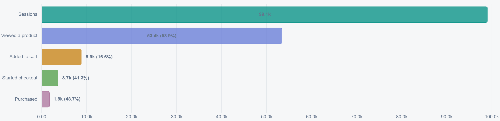
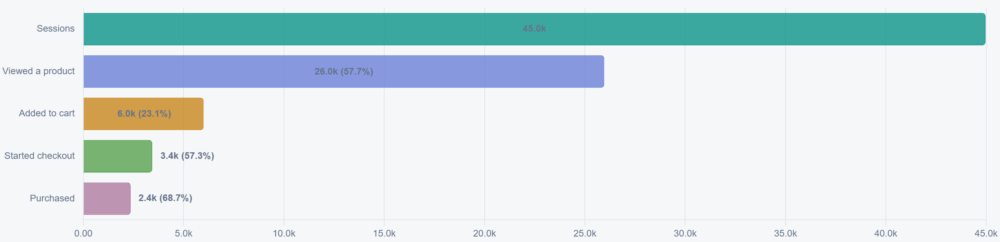

**Decision brief · September 2026 · Synthetic demo data**

Mobile brings nearly two-thirds of Northwind's sessions, yet only **1.80%**
end in a purchase, compared with **5.24%** on desktop. Prioritize a mobile
checkout investigation before running another cosmetic button experiment.
The evidence identifies where to look; it does not establish the cause.

## Question

Where should Northwind focus its next conversion improvement?

This analysis examines **1–30 September 2026**, across all channels in the
[Cart Funnel report](https://trellum.dev/demo/cart-funnel/). It preserves the
views used for this decision so the reasoning remains readable after the
report refreshes. Northwind is fictional: the numbers, conclusions, and
proposed actions demonstrate an analyst's workflow.

## Findings

### Mobile is the largest opportunity to investigate

Of **156,707 sessions**, 99,072 were on mobile: **63.22%** of the total.
Mobile produced 1,782 purchases, compared with 2,358 from fewer than half as
many desktop sessions. Overall conversion was **2.86%** (4,477 purchases
divided by 156,707 sessions).

| Device | Sessions | Purchases | Session-to-purchase conversion |
| --- | ---: | ---: | ---: |
| Mobile | 99,072 | 1,782 | 1.80% |
| Desktop | 44,967 | 2,358 | 5.24% |
| Tablet | 12,668 | 337 | 2.66% |

Conversion is **purchases / sessions**, using summed counts for the whole
period. It is not an average of daily percentages or a unique-customer rate.
Desktop is a useful comparison, not an achievable target we can assume for
mobile; audience and channel mix may differ.

### The gap extends beyond the final button

Mobile's purchase rate is **3.45 percentage points** below desktop's. Several
steps contribute to that difference:

| Step | Mobile | Desktop |
| --- | ---: | ---: |
| Product view → add to cart | 16.57% | 23.09% |
| Add to cart → start checkout | 41.32% | 57.29% |
| Start checkout → purchase | 48.73% | 68.67% |

Each percentage divides the next stage's count by the preceding stage's
count. The final step loses 1,875 of 3,657 mobile checkout starts. That makes
checkout worth investigating, while the earlier gaps mean we should also
inspect product selection and cart behavior. These aggregate counts do not
tell us whether shipping costs, usability, payment errors, or buyer intent
explain the losses.

## Evidence

### Mobile funnel

**Reporting period: 1–30 September 2026. Device: Mobile. Channels: all.**
The final three stages are 8,851 carts, 3,657 checkout starts, and 1,782
purchases. Percentages printed inside or beside the bars compare each stage
with the previous one; they are not the overall purchase rate.

### Desktop comparison

**Reporting period: 1–30 September 2026. Device: Desktop. Channels: all.**
The same report and date range yield 5,994 carts, 3,434 checkout starts, and
2,358 purchases. Compare the counts and percentages: each chart uses its own
horizontal scale, so bar lengths are not directly comparable across images.

The captions record the active filters, capture time, and source build time.
Those timestamps describe the artifacts; **September is the reporting
period**. These committed images do not change when Cart Funnel rebuilds.
Its source link opens the current report, which may contain a different
date range or regenerated demo data.

## Assumptions and limits

- **Synthetic, fixed snapshot.** This example uses the full 420-day fixture
  ending 7 October 2026, seed 42. A fresh or small demo warehouse can produce
  different totals. The article remains a record of this snapshot.
- **Aggregate stages.** The demo supplies daily counts by device and channel,
  not linked session histories. We treat stages as a funnel for this example;
  real analysis must verify event definitions, deduplication, and order.
- **Association, not causation.** Device groups are not randomly assigned.
  Channel mix, returning customers, and purchase intent could explain part
  of the difference. This comparison does not measure an experiment's lift.
- **No revenue forecast.** Purchases alone do not establish revenue or margin.
  We have not assumed that mobile can reach desktop conversion.
- **Source access is separate.** Readers receive these published captures.
  In a private deployment, a source link still requires permission to open
  the underlying report.

## Recommendation

**Investigate mobile checkout first, then test a specific cause.**

1. **Validate the measurement.** Ask the analyst and instrumentation owner to
   reconcile checkout starts and purchases, inspect duplicate events, and
   split the mobile gap by channel and returning-customer status.
2. **Observe the experience.** Ask the product team to review the mobile cart
   and checkout on common devices, including shipping-cost disclosure,
   payment failures, and form errors. Record the evidence before choosing a
   change.
3. **Design one focused experiment.** If that work identifies a problem,
   write its hypothesis, eligible audience, sample-size plan, and stopping
   rule before launch. Use purchases per eligible mobile session as the
   primary measure; monitor revenue per session, payment failures, and
   refunds as guardrails.
4. **Publish the decision.** Commit a new analysis revision with the test
   result and new evidence. Keep this baseline in Git history so reviewers
   can trace why the experiment was proposed.

We would reconsider the priority if the gap disappears after measurement
corrections or comparable audience segmentation. Until then, the result is
a prioritized investigation, not a claim that a particular redesign works.
